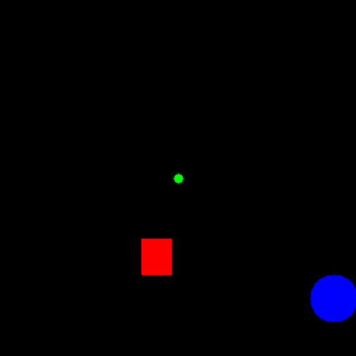
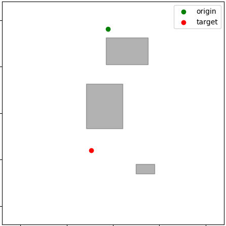

## UAV RL Enviroment

*Fully explained in my [Master Thesis](https://github.com/itsTAMART/Master-Thesis/blob/master/MasterThesis_Daniel_Tapia.pdf).*

A simple and fast environment for Local Path Planning and obstacle avoidance tasks. It was created entirely in Python using numeric libraries like Numpy and geometrical ones like Shapely, and following the interface of OpenAI Gym. This resulted in a performance increase of $\times$100, going from 5fps to 500fps in training.

.

The environment consists of a 2D rectangular map with rectangular obstacles placed randomly inside, the starting point and the goal location. To mitigate the problem of sample efficiency we did the environment very simple so that it could run fast and the agents could be trained in a couple of hours. The environment also supports a wide variety of modes created to accelerate the research iteration process. Some of the features implemented are:

- discrete and continuous actions, 
- cartesian and polar actions,
- dense and sparse reward functions,
- domain randomization on the goal placement (allowing you to not reset the objective till the episode is completed),
- images as observations (an example in the GIF above) ,
- custom sized maps with variable number of obstacles and different levels of difficulty,
- curriculum learning mode and
- an interface to work with AirSim dynamics as the transition function.

We can see an example of a generated environment in the image below where the grey rectangles are the obstacles, the green dot is the starting point and the red dot is the goal.

